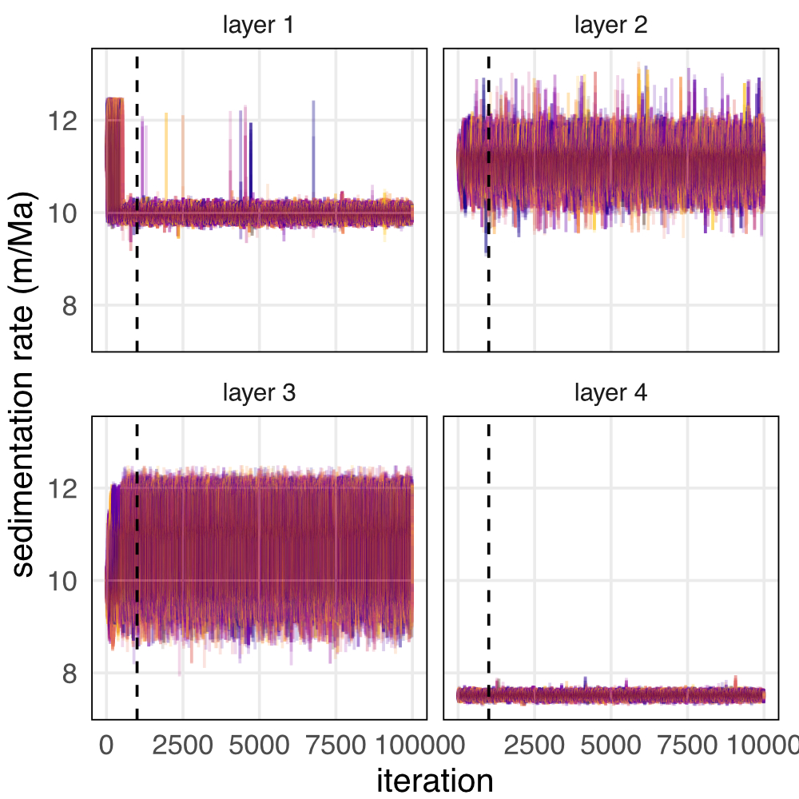
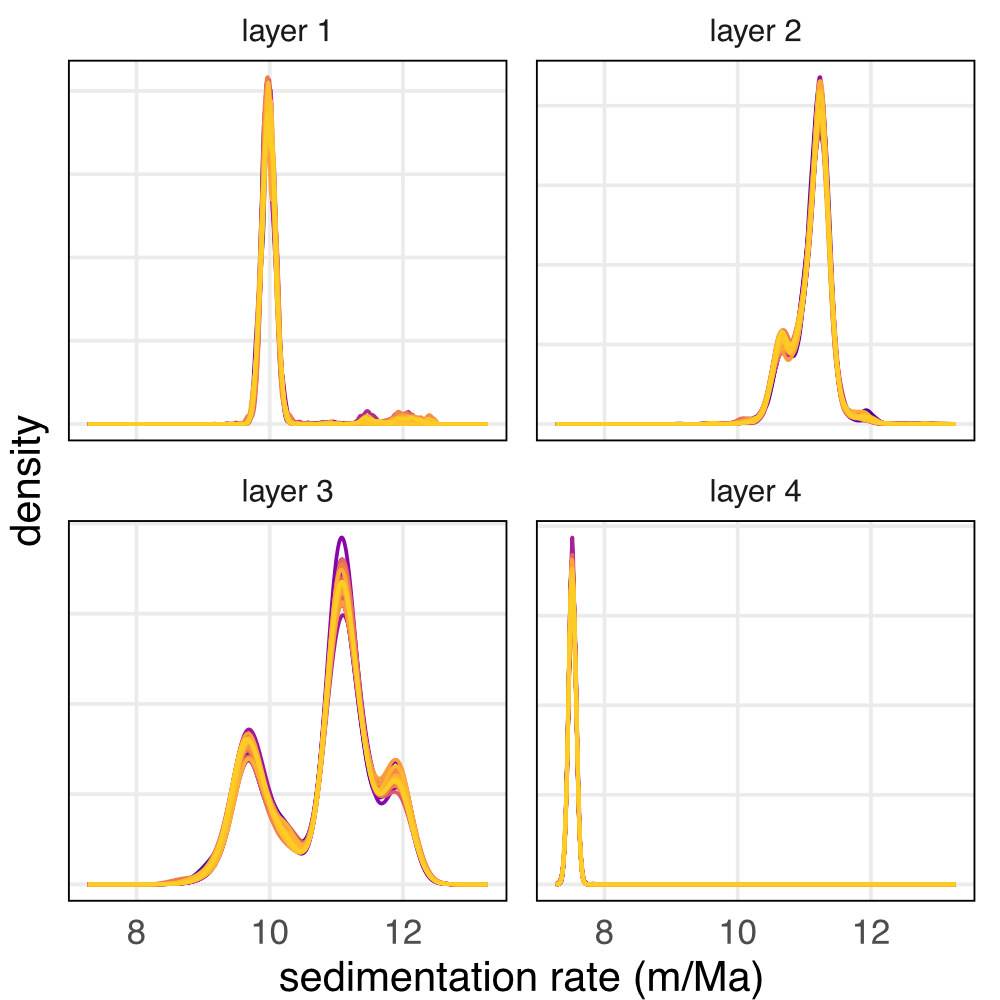
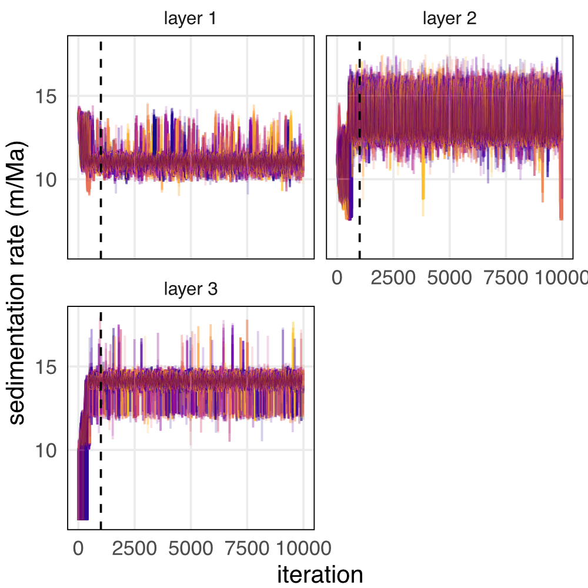
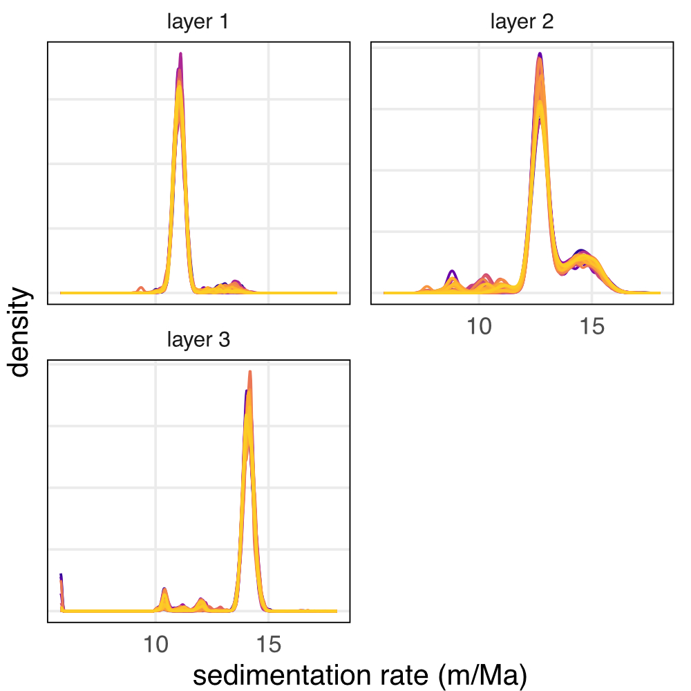

<!-- pandoc -s -f markdown+mark -o manuscript.pdf --pdf-engine=xelatex --filter pandoc-crossref --citeproc --number-sections manuscript.md --> 

<!-- pandoc -s -f markdown+mark -o manuscript.docx --pdf-engine=xelatex --filter pandoc-crossref --citeproc --reference-doc=reference.docx manuscript.md --> 

> ^1^Department of Life and Environmental Sciences, University of California, Merced, CA
> 
> ^2^Department of Geosciences, Boise State University, Boise ID
> 
> ^3^Department of Geosciences, University of Wisconsin, Madison, WI
>
> ^4^Department of Earth and Planetary Sciences, Northwestern University, Evanston, IL
> 
> ^\*^Corresponding author: rtrayler@ucmerced.edu

# Abstract {.unnumbered}

Age-depth models that relate stratigraphic position to time play an important role in interpreting the rate and timing of environmental change throughout Earth history. Astrochronology — using the geologic record of rhythmic astronomical oscillations to measure the passage of time—has proven a valuable technique for generating age-depth models and durations of time in rock sequences. However, in the absence of temporal anchoring information, many deep time astrochronologies float in "absolute" numerical time. Alternatively, radioisotopic geochronology (e.g., U-Pb, ^40^Ar/^39^Ar) produces point-estimates of numerical age, usually dispersed randomly throughout stratigraphy, which can be used to anchor floating age-depth models. 

In this study we present a new `R` package, `astroBayes` for Bayesian integration of radioisotopic geochronology and astrochronology into age-depth models. Most existing Bayesian accumulation models use a stochastic random walk to approximate the variability and uncertainty of sedimentation. Integration of the astrochronologic record and radioisotopic dates allows reduction of uncertainties related to interpolation between dated horizons and captures subtle changes in sedimentation rate recorded by astrochronology. `astroBayes` simultaneously inverts astrochronologic records and radioisotopic dates, while incorporating prior information about sedimentation rate, superposition, and the presence of major hiatuses. Resulting anchored age depth models preserve both the continuity of floating astrochronologies and the precision and accuracy of modern high precision radioisotopic geochronology. 

We tested the `astroBayes` method using two synthetic data sets designed to mimic real-world stratigraphic sections. Model uncertainties are relatively constant with depth, primarily controlled by the precision of radioisotopic ages, and significantly reduced relative to stochastic random walk models between dated horizons; the uncertainty in accumulation rate was improved by a factor of three. Furthermore, since the resulting age-depth models combine both astrochronology and radioisotopic geochronology in a single inversion, they leverage the strengths of, and naturally resolve ambiguities between, the two timekeepers. Finally, we present a case study of the Bridge Creek Limestone Member of the Greenhorn Formation where we refine the age of the Cenomanian-Turonian Boundary. 

\newpage

# Introduction

Linking the rock record to numerical time is a crucial step when investigating the timing, rate, and duration of geologic, climatic and biotic processes, but constructing chronologies (age-depth modeling) from the rock record is complicated by a variety of factors. The premier radioisotopic geochronometers enable direct determination of a numerical date from single mineral crystals (e.g., sanidine, zircon) to better that 0.1% throughout Earth history [@schmitz2013]. However, rocks amenable to radioisotopic dating, mostly volcanic tuffs, may only occur as a few randomly distributed horizons within a stratigraphic section. This leads to the problem of a small number of high-precision dates scattered throughout stratigraphy with limited chronologic information between these horizons. Consequently, chronologies developed using only radioisotopic dates have widely varying uncertainties throughout a given stratigraphic record, with precise ages near the position of the dates and increasing uncertainties with distance from the dated horizons [@blaauw2011; @parnell2011; @trachsel2017; @trayler2020a]. 

Adding more chronological information is the best way to improve age-depth model construction [@blaauw2018]. In particular, including stratigraphically continuous data can significantly reduce model uncertainties. Astrochronology uses the geologic record of oscillations in Earth's climate system ("Milankovitch cycles") to measure the passage of time in strata [@hinnov2013; @laskar2020]. Some of these oscillations can be linked to astronomical physics with well understood periods, including changes in the ellipticity of Earth's orbit (eccentricity; ~0.1 Ma, 0.405 Ma), Earth's axial tilt (obliquity; ~0.041 Ma), and axial precession (precession; ~0.02 Ma) [@laskar2020]. The manifestation of these astronomical periods in the rock record can be leveraged as a metronome that provides a direct link between the rock record and age time (either “floating” or “anchored” astrochronologies”; see reviews of @hinnov2013 and @meyers2019). Unlike radioisotopic dating methods, astrochronology produces near-continuous chronologies from stratigraphic records, sometimes at centimeter spatial resolution and 10^4^-year scale temporal resolution. The encoding of the periodic signal tracks changes in sediment (rock) accumulation rate and can be deconvolved through statistical analysis into robust durations of time, a strength that makes astrochronology an ideal tool for fine-scale investigations of geologic proxy records. However, perhaps the biggest limitation of astrochronology is that, in the absence of independent constraints, it typically produces “floating” chronologies that lack definitive anchoring to numerical time scales.

Combining floating astrochronologies and radioisotopic dates into an integrated model of age is an attractive prospect, as it leverages the strengths and overcomes the limitations of both data sources. Here we present a freely available `R` package (`astroBayes`; *Bayesian Astrochronology*) for joint Bayesian inversion of astrochronologic records and radioisotopic dates to develop high-precision age-depth models for stratigraphic sections. Following introduction of the new method, we investigate the sensitivity of `astroBayes` age-depth model construction to a variety of geologic scenarios, including varying the number and stratigraphic position of radioisotopic dates and the presence or absence of depositional hiatuses. We also present a case study from the Bridge Creek Limestone Member (Greenhorn Formation) of the Western Interior Basin (Meyers et al., 2012), where we refine the age of the Cenomanian–Turonian boundary using `astroBayes`.

the `astroBayes` method has several strengths over existing "dates only" age-depth models [@blaauw2011; @trayler2020a; @haslett2008; @keller2018b]. The inclusion of astrochronological data allows more densely constrained sedimentation models which results in an overall reduction in model uncertainty. Furthermore, these age-depth models are anchored in numerical time while simultaneously preserving astrochronologic durations minimizing "tuning" assumptions and potential missassignment of Milankovitch frequencies. These properties make the joint inversion ideal for correlating individual proxy records to other global records, enhancing our ability to constrain phase relationships and mechanisms of Earth System evolution.

# Theory

## Astrochronology

Quasiperiodic variations in Earth’s orbital and rotational parameters impact the spatial and temporal distribution of sunlight on the planet’s surface, and thus have the potential to alter regional and global climate. Such quasiperiodic climate changes can influence sedimentation and be preserved in the geologic archive, providing a dating tool for developing astronomical timescales, or astrochronologies. The astronomical variations include orbital eccentricity, with modern periods of 0.405 Ma and ~0.1 Ma, axial tilt (obliquity) with a dominant period of ~0.041 Ma today, and axial precession, with multiple periods near ~0.02 Ma today [@laskar2020].  Solar system chaos limits reliable calculation of the full theoretical eccentricity solution to ~50 Ma, although the ‘long eccentricity’ cycle of 0.405 Ma is the most stable and likely suitable for use throughout the Phanerozoic [@laskar2020]. Recently,@hoang2021 presented a new probabilistic model that permits estimation of all eccentricity cycle periods and their uncertainties throughout Earth history. In addition to Solar system chaos, Earth’s dynamical ellipticity and tidal dissipation influence the temporal evolution of the precession and obliquity cycle periods, making them shorter in the geologic past, and there exist models of varying complexity for their estimation [@berger1966; @laskar2004; @waltham2015; @farhat2022; @laskar2020]. Additional sources of uncertainty in floating astrochronologies include: (1) contamination of the astronomical-climate signal by other climatic and sedimentary processes, (2) spatial distortion of the astronomical cycles in the stratigraphic record including hiatus, and (3) uncertainties in the temporal calibration/interpretation of the observed spatial rhythms [@meyers2019]. The design of the astroBayes approach carefully considers these sources of uncertainty.

## Radioisotope Geochronology

Radioisotope geochronology utilizes the radioactive decay of a long-lived parent isotope to its daughter product within a closed geologic system to the determine its age. Temporal information is quantified in the evolving ratio of daughter to parent, as a function of the decay constant(s) of the constitutive nuclear reactions. In the case of sedimentary strata in deep time, these geologic systems are either radioisotopes captured in rapidly erupted and deposited igneous mineral grains in discrete interbedded volcanic tuff horizons (U-Pb in zircon or K-Ar [implemented as the ^40^Ar/^39^Ar technique] in feldspar), or endogenous sediment-bound radioisotopes that are fractionated during depositional processes at the sediment-water interface (Re-Os in organic-bearing sedimentary rocks). The details of application of high-precision radioisotopic dating in the stratigraphic record may be found in reviews by @bowring2003,  @jicha2016, and @schmitz2020. The age interpretation is generally the result of an ensemble of measured ratios and/or dates interpreted as a model age, for example a weighted mean of numerous single crystal dates (U-Pb and ^40^Ar/^39^Ar), a Bayesian estimation of the eruption age from the variance of those single crystal dates [@keller2018], or an isochronous relationship between sample aliquots (Re-Os). Radioisotopic model ages have an uncertainty that is usually described by a Gaussian probability function. In the case of either volcanic tuffs or endogenous sedimentary dating, the age constraints come from a restricted number of specific sampling horizons, which are generally stochastically present, preserved, and/or sampled within a stratigraphic succession.

## Bayesian Statistics

The Bayesian statistical approach aims to determine the most probable value of unknown parameters given *data* and *prior* information about those parameters. This is formalized in Bayes' equation: 

$$P(parameters | data) \propto P(data | parameters) \times P(parameters)$$ {#eq:bayes} 

The first term on the righthand side of @eq:bayes, known as the likelihood, is the conditional probability of the data, given a set of model parameters. The second term represents any prior beliefs about these model parameters. The left-hand side is the posterior probability of the model parameters. Bayes' equation is often difficult or impossible to solve analytically, and instead the posterior distribution is evaluated using Markov Chain Monte Carlo methods (MCMC) to generate a representative sample, which assuming a properly tuned MCMC process [@haario2001], should have the same properties (mean, median, dispersion, etc.) as the theoretical posterior distribution [@gelman1996].   

## Bayesian Age-Depth Modeling

Existing Bayesian methods for age-depth model construction rely on sedimentation models that link stratigraphic position to age through mathematical functions that approximate a sedimentation process conditioned through dated horizons throughout a stratigraphic section, which are then used to estimate the age and uncertainty at undated points [@blaauw2012]. A variety of Bayesian approaches have been proposed to construct age-depth models including `Bchron` [@haslett2008] `rbacon` [@blaauw2011], and `Chron.jl` [@schoene2019; @keller2018b]. While these methods vary considerably in their mathematical and computational framework, most share two fundamental characteristics. First, they treat sediment accumulation as a stochastic process where accumulation rate is allowed to vary randomly and considerably throughout a stratigraphic section. Second, they use this stochastic sediment accumulation model in tandem with discrete point-estimates likelihoods of numerical age, usually in the form of radioisotopic dates (e.g., ^40^Ar/^39^Ar, U-Pb, ^14^C), as the basis for chronology construction. This leads to "dates-only" chronologies with widely variable uncertainties [@trachsel2017; @telford2004; @devleeschouwer2014] that are largely a function of data density. That is, modeled age errors are lower in areas where there are more point-estimate age determinations, and age errors are higher in areas with less data, leading to "sausage" shaped uncertainty envelopes [@devleeschouwer2014].

Previous Bayesian approaches for  linking astrochronology and radioisotopic dates have: (1) solely focused on improving the ages of radioisotopically dated horizons using astrochronology [@meyers2012]; (2) relied on post-hoc comparisons of computed astrochronologic and radioisotopic durations to accept or reject accumulation models in the Markov chain Monte Carlo process [@devleeschouwer2014] or (3) "transformed" astrochronologic durations into age likelihoods via anchoring to other radioisotopically dated horizons [@harrigan2021]. @meyers2012 modified the Bayesian “stacked bed” algorithm of @buck1991 to incorporate known astrochronologic durations between dated horizons, allowing for the improvement of Cretaceous radioisotopic age estimates using astrochronology, and the age of the Cenomanian/Turonian boundary. Their approach, however, did not explicitly model posterior age estimates for intervening strata in the Bayesian inversion. @devleeschouwer2014 recalibrated the Devonian time scale and calculated new stage boundaries using a two-step process. First the authors generated a continuous Bayesian age-depth model using the  `Bchron` `R` package [@haslett2008] and the performed a post-hoc rejection of model iterations that violated previously derived astrochronologic stage durations. While these results are consistent with both data types, the two step process does not fully integrate and leverage astrochronology in the age-model construction. @harrigan2021 further refined the Devonian timescale by using a modified version of `Bchron` [@trayler2020a]. The authors used a Monte Carlo approach to convert astrochronology derived durations into stage boundary ages which were then included as inputs along-side radioisotopic dates for Bayesian modeling. Each of these methods requires external processing and interpretation of astrochronologic data, either to derive durations or to transform them into a form (i.e., age ± uncertainty) that is amenable to inclusion within existing models. In this study we present a new approach designated astroBayes, which fully leverages the advantages of radioisotopic ages and astrochronology by explicitly including both in the Bayesian inversion. 

# Methods

## Model Construction

{#fig:workflow width=75%}

| Parameter |                       Explanation                        |
|:---------:|:---------------------------------------------------------|
|    *r*    | sedimentation rate (m/Ma)                                |
|    *z*    | layer boundary positions (stratigraphic positions)       |
|    *a*    | anchoring age (Ma)                                       |
|    *D, d* | depth (stratigraphic positions; transformation of *z*)   |
|    *h*    | hiatus duration (Ma)                                     |
|    *T, t* | age (Ma; transformation of *r* and *z*)                  |
|    *f*    | orbital target frequencies (cycles/Ma)                   |
|  *data*   | astrochronologic data (value vs stratigraphic position)  |
|  *dates*  | radioisotopic dates (Ma)                                 |

Table: Summary of model parameters. {#tbl:parameters}

The inputs for `astroBayes` consists of measurements of a cyclostratigraphic record (*data*) (e.g., δ^18^O, XRF scans, core resistivity, etc.), and a set of radioisotopic dates (*dates*) that share a common stratigraphic scale. Developing an age-depth model from these records requires 1) a likelihood function that reflects the probability of both data types; 2) a common set of model parameters to be estimated; and 3) in the case of continuous age-depth modeling, a model that reflects the best approximation of sediment accumulation. We focus on estimating the probability of sedimentation rate as the basis for the `astroBayes` age-depth model. Since sedimentation rate is expressed as depth-per-time (e.g., m/Ma, cm/ky) it directly links stratigraphic position to relative age to create floating age models, and when combined with radioisotopic dates, generates models anchored in numerical time. 

Existing Bayesian age-depth modeling approaches approximate sedimentation as a relatively large number of piecewise linear segments. Sedimentation rate can vary substantially between segments, leading to the "sausage-shaped" uncertainty envelopes that characterize these models [@trachsel2017; @devleeschouwer2014; @parnell2011]. However, this model of sedimentation is not ideal for the construction of astrochronologies because fluctuations in sedimentation rate can be constrained by preserved astronomical frequencies as spatial stretching or compression of the preserved rhythm. We adopt a sedimentation model with a small number (< 10) of layers of consistent sedimentation rate, following a common astrochronologic approach of minimizing fine-scale fluctuations in sedimentation rate [@muller2002; @malinverno2010]. However, the general approach can be adapted to include any number of layers.

@malinverno2010 presented a simple sedimentation model appropriate for astronomical tuning of sedimentary records and we use their framework as the starting basis for the joint inversion. The sedimentation model consists of two sets of parameters. The first is a vector of sedimentation rates (*r*), and stratigraphic boundary positions (*z*) that define regions ("layers") of constant sedimentation (@fig:workflow A). For example, the model shown in @fig:workflow A has 11 parameters, five sedimentation rates (*r~1~* -- *r~i~*) and six layer-boundaries (*z~1~* -- *z~i~*). This model formulation allows step changes in sedimentation rate at layer boundaries (*z*) but otherwise holds sedimentation rate (*r*) constant within each layer. 

The selection of layer boundary position  is informed by detailed investigation of the cycostratigraphic data. Evolutive harmonic analysis (EHA) is a time-frequency method that can identify changes in accumulation rate by tracking the apparent spatial drift of astronomical frequencies. Expressed as cycles/depth, high amplitude cycles may "drift" towards higher or lower spatial frequencies throughout the stratigraphic record. Assuming these frequencies reflect relatively stable astronomical cycles, the most likely explanation of those shifts is therefore stratigraphic changes in sedimentation rate [@meyers2001]. We visually inspected EHA plots to develop a simple sedimentation model (e.g., @fig:workflow B) for our testing data sets. We chose layer boundary positions (z~1~ -- z~i~) by identifying regions with visually stable spatial frequencies (see @fig:testing_data). We allow these boundary positions to vary randomly (within a specified stratigraphic range) to account for the stratigraphic uncertainties in boundary position, similar to the approach of @malinverno2010.

Together *r* and *z* can also be transformed to create an age-depth model consisting of piecewise linear segments that form a floating age-depth model (@fig:workflow B). This floating model can be anchored in numerical time by adding a constant age (*a*) to the floating model at every stratigraphic position. Optionally, sedimentary hiatuses can also be included in the model in a similar manner by adding the duration of a hiatus (*h*) at any of the layer boundary positions to all of the points below the stratigraphic position of the hiatus.

## Probability Estimation

Together the vectors of sedimentation rates (*r*), layer boundaries (*z*), and anchoring age (*a*) can be used to calculate an anchored *age-depth model* that consists of a series of piecewise linear segments (@fig:workflow B). The slope (m/Ma) and length of these segments is controlled by the sedimentation rates (*r*) and layer boundary positions (*z*), while the numerical age is controlled by the anchoring constant (*a*). Hiatuses (*h*) at each layer boundary can offset the age-depth model in time. The anchored age-depth model now consists of a vector of stratigraphic positions (*D*) and a corresponding vector of ages (*T*) that relate stratigraphic position to numerical age. The probability of this age-depth model can be assessed by calculating the probability of the sedimentation rates (*r*) and anchoring constant (*a*) given an astrochronologic record (*data*) and a series of radioisotopic dates (*dates*). 

### Probability of an Astronomical Model

We followed the approach of @malinverno2010 to calculate the probability of our data given a sedimentation rate and set of target astronomical frequencies (*f*).  

$$P(data |r, f) \propto exp[\frac{C_{data}(f)}{C_{background}(f)}]$$ {#eq:malinverno}

Where the data is the astrochronologic record, *r* is a sedimentation rate, and *f* is an astronomical frequency (e.g., @tbl:frequencies), *C~data~* is the periodogram of the data, and *C~background~* is the red noise background. The probability in @eq:malinverno is calculated independently for each model layer (i.e., between adjacent *z*'s), and the overall probability is therefore the joint probability of all layers. @eq:malinverno calculates the concentration of spectral power at specified astronomical frequencies, where a given sedimentation rate is more probable if it causes peaks in spectral power that rise above the red noise background to "line up" with astronomical frequencies. The red noise background is approximated using a lag-1 autoregressive process [@gilman1963] which provides a useful stochastic model for climate and cyclostratigraphy [@gilman1963; @hasselman1976]. 

| Period (Ma) | Frequency (1/Ma) |    Cycle      |
|:-----------:|:----------------:|:-------------:|
| 0.4056795   |        2.465000  | eccentricity  |
| 0.1307190   |        7.649997  | eccentricity  |
| 0.1238390   |        8.075001  | eccentricity  |
| 0.0988631   |       10.115001  | eccentricity  |
| 0.0948767   |       10.540000  | eccentricity  |
| 0.0409668   |       24.410000  | obliquity     |
| 0.0236207   |       42.335766  | precession    |
| 0.0223187   |       44.805517  | precession    |
| 0.0189934   |       52.649737  | precession    |
| 0.0190677   |       52.444765  | precession    |

Table: Astronomical frequencies used for model testing and validation for both testing data sets (discussed below). {#tbl:frequencies}

### Probability of Radioisotopic Dates

The anchored age-depth model now consists of two paired vectors that relate stratigraphic position (*D*) to numerical time (*T*). The stratigraphic positions of the dates {*d~1~* ... *d~j~*} and their corresponding ages [*t~1~* ... *t~j~*] are a subset of *D* and *T*, respectively. We therefore define the probability of the modeled age (*T*) at a depth (*D*), given a set of dates as: 

$$P(T | dates) = \prod_{j = 1}^{n} N(\mu_j, \sigma^{2}_{j})$$ {#eq:radio_prob}

Where $N$ is a normal distribution with a mean (μ) and variance (σ^2^). *μ~j~* is the weighted mean age and *σ^2^~j~* is the variance of the j^th^ radioisotopic date at stratigraphic position *d~j~*. Notice that while *d* and *t* are continuous over the entire stratigraphic section, only the stratigraphic positions that contain radioisotopic dates influence the probability of the age model. In effect, this probability calculation reflects how well the age model "overlaps" the radioisotope dates, where modeled ages that are closer to the radioisotopic dates are more probable (@fig:workflow B [@schoene2019; @keller2018b]. 

### Overall Probability and Implementation

The overall likelihood function of an anchored age-depth model is now the joint probability of @eq:malinverno and @eq:radio_prob. We use a vague uniform prior distribution where sedimentation rate may take any value between a specified minimum and maximum value. `astroBayes` estimates the most probable values of sedimentation rate, anchoring age, and hiatus duration(s) using a Metropolis-Hasting algorithm and an adaptive Markov Chain Monte Carlo (MCMC) sampler [@haario2001]to generate a representative posterior sample for each parameter. The complete model is available as an `R` package called `astroBayes` (*Bayesian astrochronology*) at [github.com/robintrayler/astroBayes](https://github.com/robintrayler/astroBayes).

## Testing and Validation

{#fig:testing_data width=100%}

We tested `astroBayes` using two synthetic data sets that consist of a known age-depth model and a paired cyclostratigraphic record. The first dataset (TD1) consists of a simple sedimentation model that was used as an earth system transfer function to  distort a normalized eccentricity-tilt-precession (ETP; @laskar2004) time series (with equal contribution of each astronomical parameter) to generate a synthetic cyclostratigraphic record (@fig:testing_data). This 2 million year ETP signal was translated into a stratigraphic signal using a stable sedimentation rate of 7.5 m/Ma for the first 0.500 Ma (the oldest portion of the record), followed by a linear sedimentation rate increase to 12.5 m/Ma until 1.0 Ma, then a linear sedimentation rate decrease to 10 m/Ma until 1.5 Ma, and finally a stable sedimentation rate of 10. m/Ma for the youngest stratigraphic interval. 

The second dataset (CIP2) was originally published by @sinnesael2019 as a testing exercise for the Cyclostratigraphy Intercomparison Project which assessed the robustness and reproducibility of different cyclostratigraphic methods. The CIP2 dataset was designed to mimic a Pleistocene proxy record with multiple complications including nonlinear cyclical patterns and a substantial hiatus. For full details on the construction of the CIP2 dataset see @sinnesael2019 and [cyclostratigraphy.org](https://www.cyclostratigraphy.org/the-cip-initiative). For each of our testing schemes, outlined below, we used the true age-depth model to generate synthetic radioisotopic dates (with uncertainties) from varying stratigraphic positions. The combination of synthetic cyclostratigraphic data and simulated radioisotopic dates form our synthetic model inputs. 

We assessed model performance using two metrics. First, we assessed model accuracy and precision by calculating the proportion of the true age-depth model that fell within the 95% credible interval (95% CI) of our model posterior. We assume that a well-performing model should contain the true age model in most cases. This method has been used previously to assess performance of existing Bayesian age-depth models [@parnell2011; @haslett2008]. Second we monitored the variability of the model median (50%) and lower and upper bounds (2.5% and 97.5%) of the credible interval.

### Reproducibility and Stability {#sec:stability}

| Data Set |   Sample    | Age±1σ (Ma) | Position (m) |
| :------: | :---------: | :---------: | :----------: |
|   TD1    |      A      | 0.069±0.01  |     0.64     |
|          |      B      | 0.520±0.02  |     5.17     |
|          |      C      | 1.790±0.05  |    17.48     |
|   CIP2   |      D      | 0.062±0.009 |     1.24     |
|          |      E      | 0.820±0.012 |     3.49     |
|          |      F      | 1.290±0.019 |     6.99     |
|          |      G      | 1.460±0.022 |     9.49     |

Table: Dates used as inputs for reproducibility & stability testing (TD1 and CIP2). {#tbl:testing_dates}

We generated 1,000 individual age-depth model simulations for each testing dataset to assess model reproducibility and stability. We used the same input data for each testing set (cyclostratigraphy (see @fig:testing_data), radioisotopic dates, astronomical frequencies; see: @tbl:testing_dates). Each simulation ran for 10,000 MCMC iterations to allow sufficient exploration of parameter space and posterior convergence to the target stationary distribution. The adaptive Metropolis-Hastings proposal algorithm adequately modulated each Markov chain after an initial discarded "burn-in" period of 1,000 steps.

### Sensitivity Testing with the Synthetic Models

We tested the sensitivity of our age-depth model results to both the number and stratigraphic position of radioisotopic dates. As mentioned above, we randomly generated a set of dates from the underlying sedimentation model using Monte Carlo methods. The uncertainty (1σ) was set at 1.5% of the age. These dates and uncertainties were used as radioisotopic age likelihoods along with the synthetic astrochronologic records. We repeated this procedure 1,000 times using 2, 4, 6, or 8 dates for a total of 4,000 simulations per testing data set (i.e., 4,000 for CIP2 and TD1). Each simulation ran for 10,000 MCMC iterations with a 1,000 iteration "burn-in".

Since the CIP2 data set includes a significant hiatus [@sinnesael2019] we also investigated the influence of the number and stratigraphic position of radioisotopic dates on the quantification of the hiatus duration. Estimating hiatus duration requires at least one date above and below the stratigraphic position of a hiatus. Consequently, we added an additional constraint when generating synthetic dates from the CIP2 dataset to ensure that the hiatus was always bracketed by at least two dates. For each of the sensitivity validation models (2, 4, 6, and 8 dates) we benchmarked the stratigraphic distance between the hiatus and the nearest date. 

# Results

## Model Validation

![Example age-depth models of the TD1 and CIP2 data sets with randomly placed dates shown as colored Gaussian distributions. The dates were randomly generated from the true age-depth model (dashed red line). The black line and shaded grey region are the `astroBayes` model median and 95% credible interval. The dark grey solid and dashed lines are `Bchron` models generated using only the dates as model inputs. Panels A - D) 2, 4, 6, and 8 date models for the TD1 data. Panels E - H) 2, 4, 6, and 8 date models for the CIP2 data. Note that the left and right columns have different vertical and horizontal scales.](./figures/final figures/random_models.pdf){#fig:random_models height=75%}

Reproducibility tests indicate that the `astroBayes` model converges quickly and its parameter estimates remain stable across model runs. Individual trace plots for each parameter (sedimentation rates, anchor age, hiatus duration [CIP2 only]) for the TD1 and CIP2 data sets stabilized quickly and appeared visually well-mixed indicating adequate exploration of parameter space (see supplemental figures @fig:TD1_trace, @fig:TD1_density, @fig:CIP2_trace, @fig:CIP2_density). Similarly, kernel density estimates of each parameter were indistinguishable among the 1,000 simulations. The model median and 95% credible interval were likewise stable, and varied by no more than ±0.005 Ma (2σ) for both testing data sets. 

<!-- run `model_reproducability.R` to replicate this number. --> 

Model accuracy does not appear to be particularly sensitive to the number or stratigraphic position of dates as the true age-depth model fell within the 95% credible interval of the `astroBayes` posterior 99% of the time with no clear bias towards greater or fewer dates (@fig:random_models). Similarly, for the CIP2 data set, other than the requirement that there is at least one date above and below the hiatus, the stratigraphic position of the dates does not appear to have a strong influence on hiatus quantification and in all cases the true hiatus duration (0.203 Ma) was contained within the 95% CI of the hiatus duration parameter (*h*; @fig:hiatus_duration). Conversely, the number of radioisotopic dates appears to have the largest effect on overall model uncertainty  (see also: @blaauw2018). As the number of dates increase the width of the 95% credible interval shrinks and approaches the input uncertainty of the radioisotopic dates (@fig:random_models). Crucially however, the uncertainties never "balloon" and  are usually close to the uncertainty of the dates, unlike "dates-only" age-depth models [@devleeschouwer2014].

# Discussion

## Developing Sedimentation Models and Constraining Uncertainty

Clearly, our choice of a simple sedimentation model for Bayesian inversion influences age-depth model construction. Since @eq:malinverno is calculated layer-by-layer, a limitation of our model is that each layer must contain enough time and astrochronologic data to resolve the frequencies (*f*) of interest. Both the astrochronologic and radioisotopic dates can inform sedimentation model construction. First, the dates can be used to calculate average sedimentation rates which to a first approximation can then inform the length of sedimentation model layers. For example, @tbl:testing_dates contains the dates and stratigraphic positions used for inputs for TD1 stability testing (see @sec:stability). A time difference of 1.72 Ma between the uppermost and lowermost dates separated by 16.84 meters implies an average sedimentation rate of ~9.8 m/Ma or alternatively ~0.1 Ma/m. A sedimentation model with a layer thickness of 1 meter would not reliably resolve long (~0.405 Ma) and short (~0.1 Ma) eccentricity cycles and would only weakly resolve obliquity (~0.41 Ma) and precession scale cycles (~0.02 Ma) within each layer. The choice of layer thickness is therefore dependent on both the average sedimentation rate, the cyclostratigraphic sampling rate, and the dominant astronomical signals present in the data. Records dominated by eccentricity and obliquity scale fluctuations will necessarily require layer thicknesses that capture longer timescales than records dominated by higher frequency obliquity and precession scale variations. Future model development could semi-automate much of this starting model construction, optimizing the number and length of layers. However, a critical prerequisite is that the cyclostratigraphic data series has a sampling rate sufficient to reliably capture the highest frequency of interest (e.g., precession).

A potential criticism of our approach may be that our choice of a simple Bayesian sedimentation model artificially reduces overall model uncertainties. Since we do not allow sedimentation rate to vary randomly at all points throughout the stratigraphy, our model lacks the inflated credible intervals that characterize "dates-only" age-depth models (i.e, `Bchron`, `rbacon`, `Chron.jl`). Indeed, @haslett2008 consider this minimum assumption of smoothness as a fundamental feature of age-depth modeling as there is *"no reason a priori to exclude either almost flat or very steep sections"*. Although @blaauw2011 consider some smoothness desirable, both modeling approaches allow sedimentation rate to vary randomly and considerably in the absence of other constraints. However, astrochronology provides a clear, strong constraint on the stratigraphic variability in sedimentation rate. Astronomical tuning approaches show that frequent changes in sedimentation rate can introduce fluctuations unrelated to astronomical frequencies [@muller2002; @malinverno2010] and stratigraphic investigation of preserved astronomical frequencies often reveals long periods of near constant sedimentation rates [@shen2022; @sinnesael2019; @meyers2001]. Therefore, the addition of cyclostratigraphic data to age-depth model construction allows for the informed development of simpler sedimentation models which result in substantially lower uncertainties.

## Hiatus Duration Estimation

{#fig:hiatus_duration}

The ability to estimate hiatus durations is a significant strength of our Bayesian modeling framework. Hiatuses in stratigraphic records significantly complicate the interpretation of biologic and geochemical proxy records. Detecting and resolving the duration of hiatuses is therefore important to ensuring the accuracy of age-depth models. In principle, hiatuses can be detected and quantified from cyclostratigraphic records alone [@meyers2004; @meyers2019]. However, these approaches can be skewed towards minimum hiatus duration and are sensitive to distortions of the astronomical signal from other non-hiatus sources [@meyers2004]. `astroBayes` relies on both astrochronology and radioisotopic geochronology to estimate the duration of one or more hiatuses with the joint inversion of  astrochronology and radioisotopic ages controlling the sedimentation rates (slopes) above and below as well as the absolute durations of layer-bounding hiatuses.

The primary weakness of this approach is that `astroBayes` cannot reliably estimate durations for hiatuses unconstrained by radioisotopic dates. If a hiatus only has radioisotopic dates stratigraphically above or below, the undated side is unconstrained and duration estimates tend to wander towards infinitely long. Likewise, if a model layer is bounded by two hiatuses and the layer does not contain any radioisotopic dates, then `astroBayes` cannot reliably resolve the duration of the bounding hiatuses and will tend to "split the difference". However, when hiatuses are well-constrained by radioisotopic dates, `astroBayes` allows the estimation of robust uncertainties of hiatus duration and is a powerful tool when there is external sedimentological or astronomical evidence for hiatuses, as shown in the case study below.

## Case Study: Bridge Creek Limestone

The Bridge Creek Limestone is the uppermost member of the Greenhorn Formation of central Colorado. It is primarily composed of hemipelagic marlstone and limestone couplets that extend laterally for over 1,000 km in the Western Interior Basin [@elder1994]. These couplets are characterized by alternations from darker organic carbon-rich laminated clay and mudstones to lighter carbonate-rich, organic carbon-poor limestone facies. Previous work has reported Milankovitch scale cyclicity in the Bridge Creek Limestone Member through the application of statistical astrochronologic testing methods [@sageman1997; @sageman1998; @meyers2001; @meyers2012; @meyers2008]. Using U-Pb and ^40^Ar/^39^Ar ages from several bentonites throughout the section to provide temporal anchoring of the astrochronology, @meyers2012 previously calibrated the age of the Cenomanian-Turonian boundary as 93.90±0.15Ma (mean±95%CI) using an adaptation of the Bayesian "stacked bed" algorithm [@buck1991] that respects both stratigraphic superposition and astrochronologic durations between the dates and the boundary position. That work used the floating astrochronology of @meyers2001, based on analysis of a high stratigraphic resolution optical densitometry record (i.e., grayscale) of the Bridge Creek Limestone Member. @meyers2004 later identified a brief hiatus in the Bridge Creek Limestone Member near the base of the *Neocardioceras juddii* ammonite biozone with an estimated minimum duration of 0.079 – 0.0254 Ma. 

| Period (Ma) | Frequency (1/Ma) |     Cycle     |
|:-----------:|:----------------:|:-------------:|
| 0.4056795   |   2.46500        | eccentricity  |
| 0.0948767   |  10.54000        | eccentricity  |
| 0.0988631   |  10.11500        | eccentricity  |
| 0.0504434   |  19.82420        | obliquity     |
| 0.0391000   |  25.57545        | obliquity     |
| 0.0279130   |  35.82561        | obliquity     |
| 0.0224100   |  44.62294        | precession    | 

Table: Astronomical target periods used for modeling the Bridge Creek Limestone Member greyscale record and ^40^Ar/^39^Ar dates. The precession and obliquity terms are based on the reconstruction of @waltham2015 at 94 Ma, and the eccentricity terms are based on the LA10d solution [@laskar2011] from 0-20 Ma. {#tbl:ct_frequencies}

We used `astroBayes` to develop two new age-depth models for the Bridge Creek Limestone Member using the the grayscale record of @meyers2001 a suite of target astronomical frequencies (@tbl:ct_frequencies). We used two sets of radioisotopic dates to develop two alternative models. For the first model (*Meyers* model) we used the ^40^Ar/^39^Ar bentonite ages of @meyers2012, and for the second (*Updated* model) we used the updated ^40^Ar/^39^Ar ages of @jones2021 and @jicha2016. Note that since the A-bentonite has not been reanalyzed, both models use the @meyers2012 age for this sample (@tbl:BCL_dates). We divided the Bridge Creek Limestone grayscale record (@fig:ct_boundary A) into three layers based on the observed shifts in the high spectral amplitude frequency-track (~1.1 cycles/m) at about 6.7 and the reported hiatus at 2.7 meters [@meyers2004] depth (@fig:ct_boundary B).

| Age Model |    Sample   |  Age±1σ (Ma) | Position (m) |    Source     |
| :-------: | :---------: | :----------: | :----------: | :-----------: |
|  Meyers   | A-bentonite | 94.20±0.140  |     1.62     | @meyers2012   |
|           | B-bentonite | 94.10±0.135  |     3.30     | @meyers2012   |
|           | C-bentonite | 93.79±0.130  |     5.95     | @meyers2012   |
|           | D-bentonite | 93.67±0.155  |     6.98     | @meyers2012   |
|  Updated  | A-bentonite | 94.20±0.140  |     1.62     | @meyers2012   |
|           | B-bentonite | 93.99±0.110  |     3.30     | @jicha2016    |
|           | C-bentonite | 94.022±0.102 |     5.95     |  @jones2021   |
|           | D-bentonite | 93.799±0.077 |     6.98     |  @jones2021   |

Table: Radioisotopic dates used used as model inputs for the two Bridge Creek Limestone Member age-depth models shown in @fig:ct_boundary. {#tbl:BCL_dates}

![Results of `astroBayes` modeling of the Bridge Creek Limestone Member greyscale record showing the modeled age of the Cenomanian Turonian Boundary. A) Bridge Creek Limestone Member grayscale record. B) Evolutive harmonic analysis of panel A) with superimposed layer boundary positions (dashed white lines). C) Two age-depth model for the Bridge Creek Limestone member. The colored probability distributions are the dates used for *Meyers model* and the grey probability distributions are the dates used for the *Updated model*. The blue points and error bars are the modeled age for the Cenomanian Turonian boundary. Note that these points have been slightly offset vertically for visual clarity.](./figures/final figures/ct_boundary.pdf){#fig:ct_boundary}

Results for both the *Meyers* and *Updated* models are shown in @fig:ct_boundary C. Evolutive harmonic analysis of the grayscale record after applying the median  *Meyers* age-depth model reveal, stable, eccentricity, eccentricity (~10 cycles/Ma) and obliquity (~20 cycles/Ma) scale frequencies, suggesting that age-depth modeling has successfully removed distortion of these astronomical frequencies as a result of varying sedimentation rates (@fig:ct_modeled). The *Meyers* and *Updated* are broadly similar, and have nearly identical posterior distributions of sedimentation rate (note the parallel model medians in @fig:ct_boundary). The *Meyers* model has a wider credible interval compared to the *Updated* model, likely a result of the somewhat more precise ages use (@tbl:BCL_dates). The *Updated* model is also systematically older than the *Meyers* model, showing the influence the revised bentonite ages have on age-depth model construction. The estimated hiatus durations from both models are similar; the *Meyers* model has a maximum density at 0.021 Ma and the *Updated* model has a maximum density at 0.014 Ma. Both durations are comparable to the duration previously reported in @meyers2004 (0.079 – 0.0254 Ma). Median hiatus durations are somewhat longer (*Meyers*- 0.104 Ma; *Updated*- 0.065 Ma) suggesting an eccentricity or precession scale hiatus (@fig:ct_hiatus). However, the previous estimates of @meyers2004 are explicitly minimum duration estimations and fall within the 95% credible interval of the `astroBayes` modeled duration.

![A) Periodogram of the Bridge Creek Limestone Member greyscale data after applying the median `astroBayes` age-depth model. The solid red line is the AR1 red noise background and the dashed red line is the 95% confidence interval. B) Evolutive harmonic analysis of  Astrologic Bridge Creek Limestone Member greyscale data after applying the median `astroBayes` age-depth model. In both panels astronomical frequencies (@tbl:ct_frequencies) used in model construction are shown as vertical dashed lines. Note that in panel B the distortion from variations in sedimentation rate (compared with @fig:ct_boundary B) has been removed.](./figures/final figures/ct_modeled.pdf){#fig:ct_modeled}

{#fig:ct_hiatus}

Finally, we calculated the age of the Cenomanian-Turonian boundary using both age depth models. The *Meyers* model age for the boundary is 93.87±0.15 Ma (median±95%CI), essentially indistinguishable from the the age of 93.90±0.15 Ma reported by @meyers2012, suggesting that `astroBayes` produces comparable results when using identical data. The *Updated* model boundary-age is slightly older (93.98±0.10 Ma; median±95%CI). The age of the Cenomanian-Turonian boundary has been revised multiple times over the past few years and has variously been reported as 93.95±0.05 Ma [@jones2021], 93.9±0.2 Ma [@gale2020], or as between 94.007 and 94.616 Ma [@renaut2023], with most revisions shifting the boundary age older towards about ~94 Ma, a trend that our *Updated* model continues. Both the *Meyers* and *Updated* model-ages are broadly comparable with these previous estimates, although they only slightly overlap with the range of @renaut2023 (@fig:ct_age). Crucially however, both age-depth models provide a continuous record of age for the Bridge Creek Limestone Member which can be used to interpret the boundary ages and durations of several ammonite biozones present in the section [@meyers2012; @meyers2001] and foster correlations to other calibrated sections. Accurate determination of the Cenomanian-Turonian boundary age is important as boundary serves as an important geochronological marker against which other boundary-ages are determined.

{#fig:ct_age}

# Conclusions

Radioisotopic geochronology and astrochronology underly the development of age-depth models that translate stratigraphic position to numerical time. In turn, these models are crucial to the evaluation of climate proxy records and the development of the geologic time scale. Existing Bayesian methods for age-depth modeling rely only on radioisotopic dates and as a consequence, cannot natively incorporate astronomical constraints on the passage of time. However astrochronology is a rich source of chronologic information and its explicit inclusion in the calculation of age-depth models can substantially improve model accuracy and precision. Here we have presented a new joint Bayesian inversion of radioisotopic and astronomical data, `astroBayes`. The method is freely available as an `R` package and contains a variety of functions for the creation and use of age-depth models including modeling, prediction, and plotting. Our testing shows that `astroBayes` outperforms dates-only age-depth models and produces chronologies that are simultaneously consistent with astrochronology and radioisotopic dates with substantially smaller model uncertainties. Reducing the uncertainty associated with geochronological data, either as discrete dates or age-depth models, allows the testing of cause-and-effect relationships of interrelated climatological and biological events over the course of earth's history [@burgess2015; @schmitz2013] and has the potential to improve the correlation of geologic events among and between basins worldwide. 

# Acknowledgements {.unnumbered}

We thank Dr. Matthias Sinnesael for providing the Cyclostratigraphy Inter-comparison Project data used for model testing. We also thank Dr. Jacob Anderson and Dr. Alberto Malinverno for insightful discussions during the development of this project. This work was supported by National Science Foundation grants EAR-1813088 (MDS) and EAR-1813278 (SRM). 

# Author contribution {.unnumbered}

RBT, and MDS conceived the project and developed the modeling framework with input from SRM. RBT wrote the code for the `astroBayes` `R` package and performed testing and validation with input from SRM and MDS. BBS contributed the Bridge Creek grayscale data. RBT, MDS, BBS, and SRM wrote and edited the manuscript. 

\newpage

# References {.unnumbered}
:::{#refs}
:::

\newpage

# Supplemental Figures {label="S"}

{#fig:TD1_trace height=100%}

{#fig:TD1_density height=100%}

{#fig:CIP2_trace height=100%}

{#fig:CIP2_density height=100%}
